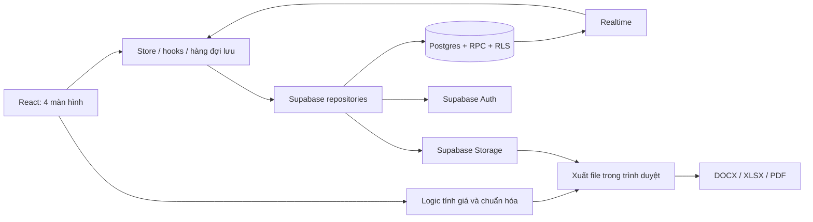

# OWIN Quote Tool

Công cụ quản lý sản phẩm và lập báo giá cửa nhôm cho OWIN: quản lý catalogue, tính giá theo kích thước/phụ kiện, lưu báo giá khách hàng, xuất tài liệu và tính tiền nhôm theo hệ/màu.

Tài liệu mô tả mã nguồn hiện tại trong repository. Domain được cấu hình triển khai là [admin.hoanganhowin.io.vn](https://admin.hoanganhowin.io.vn); cấu hình này không phải xác nhận tình trạng dịch vụ đang chạy.

## Mục lục

- [Chức năng](#chức-năng)
- [Luồng sử dụng và cách lưu](#luồng-sử-dụng-và-cách-lưu)
- [Logic báo giá](#logic-báo-giá)
- [Logic bảng giá](#logic-bảng-giá)
- [Logic tính nhôm](#logic-tính-nhôm)
- [Kiến trúc kỹ thuật](#kiến-trúc-kỹ-thuật)
- [Mô hình dữ liệu](#mô-hình-dữ-liệu)
- [Đồng bộ và xung đột](#đồng-bộ-và-xung-đột)
- [Ảnh và xuất tài liệu](#ảnh-và-xuất-tài-liệu)
- [Xác thực và phân quyền](#xác-thực-và-phân-quyền)
- [Cài đặt và phát triển](#cài-đặt-và-phát-triển)
- [Triển khai và vận hành](#triển-khai-và-vận-hành)

## Chức năng

### Sản phẩm

- Tạo, sửa, nhân bản, xóa mềm; tìm kiếm và lọc danh mục.
- Quản lý mã, tên, nhóm, đơn vị, đơn giá VND, mô tả, kích thước mẫu, thông số kỹ thuật, ảnh bìa và gallery.
- Khai báo bộ phụ kiện cố định, phụ kiện phát sinh và phụ kiện kiểu cũ; autocomplete tên/thông số từ dữ liệu đã dùng.
- Có cờ nổi bật/công khai `isFeatured`, `isPublic`, xem trước sản phẩm và phóng to ảnh.
- Kéo thả sắp xếp, chuyển sang bảng giá, điều chỉnh đơn giá hàng loạt theo phần trăm.
- Điều chỉnh hàng loạt áp dụng **toàn bộ sản phẩm đang hoạt động**, có xem trước và xác nhận: `giá mới = max(0, round(giá cũ × (1 + phần trăm / 100)))`.
- Mã sản phẩm mới/nhân bản dựa trên thời gian và phần bổ sung ngẫu nhiên; ID bản ghi tách biệt mã hiển thị.

### Báo giá

- Lịch sử báo giá: tìm theo mã/tên khách/số điện thoại, lọc trạng thái; xem chi tiết, sửa, nhân bản và xóa mềm.
- Nhập tên khách, điện thoại, email, địa chỉ, ngày báo giá và đặt cọc.
- Chọn sản phẩm từ catalogue hoặc thêm hạng mục tùy chỉnh.
- Mỗi hạng mục có nhiều dòng kích thước với đơn vị, số lượng, đơn giá riêng; sửa thông số, mô tả, ảnh và phụ kiện độc lập.
- Nhân bản/xóa/thu gọn/mở rộng hạng mục, lọc nhóm, sắp xếp tự động và kéo thả.
- Tính tức thời tiền sản phẩm, phụ kiện, tổng, tổng làm tròn và còn lại.
- Lưu snapshot nội dung/giá tại thời điểm lưu; xuất Word, Excel, PDF từ form hoặc báo giá đã lưu.

### Bảng giá

- Xem catalogue theo nhóm, có ảnh, thông số, kích thước mẫu, tiền sản phẩm/phụ kiện và tổng hoàn thành.
- Lọc nhóm và xuất nhóm đang chọn hoặc toàn bộ danh sách theo lựa chọn giao diện.
- Xuất Word có hạn chế chỉnh sửa, Excel và PDF tải trực tiếp.

### Tính nhôm

- Sáu hệ có sẵn: Nội thất, XFA OWIN, Vát cạnh, Thủy lực, Lùa VIP 70+90, Chấn song.
- Tra cứu mã/ảnh profile; nhập số lượng, đơn giá, ghi chú.
- Bảng giá hai màu **Ghi - Cafe**, **Vân Gỗ**, quy đổi giá theo mốc.
- Tổng số dòng đã nhập, số lượng, thành tiền; xuất Word hoặc in/lưu PDF theo hệ hiện tại hay toàn bộ hệ.

## Luồng sử dụng và cách lưu

1. Đăng nhập tài khoản Supabase đã được quản trị viên tạo.
2. Tạo/cập nhật sản phẩm và bấm Lưu.
3. Tạo báo giá, nhập khách hàng, chọn sản phẩm hoặc hạng mục tự nhập.
4. Nhập kích thước theo mét, số lượng, giá, phụ kiện; kiểm tra tổng và đặt cọc.
5. Bấm **Lưu báo giá** để ghi Supabase; tải định dạng tài liệu cần gửi khách.
6. Mở lịch sử để xem lại, chỉnh sửa, nhân bản hoặc xuất lại snapshot.

| Dữ liệu/thao tác | Cách lưu hiện tại |
| --- | --- |
| Form sản phẩm | Lưu thủ công; có trạng thái chưa lưu/đang lưu/đã lưu/lỗi và thử lại |
| Form báo giá | Lưu thủ công; thay đổi đầu vào chỉ đánh dấu chưa lưu |
| Xuất từ form báo giá | Tạo file từ nội dung hiện tại, **không tự lưu báo giá** |
| Xuất từ lịch sử/chi tiết | Xuất snapshot, sau đó ghi metadata lần xuất và trạng thái |
| Ảnh được chọn upload | Upload Storage riêng, có thể trước khi lưu form |
| Kéo thả/đổi giá hàng loạt | Thao tác ghi Supabase riêng |
| Đơn giá/ghi chú/cấu hình nhôm | Tự lưu sau khoảng 850 ms khi phần dữ liệu bền vững thay đổi |
| Số lượng nhôm | Chỉ trong bộ nhớ phiên, không ghi Supabase; refresh sẽ mất |
| Gợi ý autocomplete | Học từ dữ liệu khi lưu sản phẩm/báo giá |

Tab đã mở được giữ mounted và chỉ ẩn khi chuyển tab, giúp giữ form trong phiên. Đây không phải cơ chế khôi phục bản nháp sau refresh. Form có xử lý cảnh báo khi rời trang với thay đổi/công việc chưa hoàn tất.

## Logic báo giá

Nguồn: [quoteEngine](owin-quote-tool/src/lib/quoteEngine/index.ts), [quoteCalculator.ts](owin-quote-tool/src/lib/quote/quoteCalculator.ts).

### Đơn vị, khối lượng và tiền dòng

`R` = rộng (m), `C` = cao (m), `SL` = số lượng. KL là khối lượng tính tiền theo đơn vị, không mặc định là trọng lượng kg.

| Đơn vị | Hiển thị | KL tính tiền |
| --- | --- | --- |
| `M2` | m² | `round3(R × C × SL)` |
| `METER` | md/mét dài | `round3((R + C) × SL)` nếu `R + C > 0`, nếu không dùng `round3(SL)` |
| `BO` | Bộ | `SL`, bỏ qua rộng/cao |

```text
Đơn giá dòng = giá riêng của dòng nếu có, nếu không dùng giá hạng mục
Tiền dòng = Math.round(KL tính tiền × đơn giá dòng)
Tiền sản phẩm hạng mục = tổng tiền các dòng kích thước
```

KL m²/md làm tròn **3 chữ số thập phân trước khi nhân giá**. Ví dụ `1,196 × 1,796 × 1 = 2,148016 → 2,148`; nhân `2.000.000` = `4.296.000đ`. Mét dài dùng `(R + C)`, không tự nhân đôi thành chu vi.

### Phụ kiện

- **Bộ cố định:** số bộ tự động = số bộ mỗi sản phẩm × tổng SL các dòng; nhập số bộ thủ công thì giữ giá trị người dùng. Khi chuẩn hóa bộ tự động, engine có fallback tổng SL tối thiểu 1.
- Tiền bộ = `round(số bộ × đơn giá bộ)`. Chi tiết trong bộ dùng mô tả thành phần, không cộng giá từng thành phần thêm lần nữa.
- Gợi ý thành phần theo tên bộ chuẩn hóa không dấu: thủy lực, Kinlong mở quay 1/2 cánh, lùa VIP 4 cánh, cửa sổ mở quay/hất, tay đơn điểm/SW. Chỉ điền khi chưa có chi tiết nhập tay.
- **Phát sinh BO:** `round(SL × đơn giá)`.
- **Phát sinh m²/md:** ưu tiên KL dương làm tròn 3 số lẻ, nếu không thì dùng SL; nhân giá rồi làm tròn đồng.
- **Kiểu cũ:** `round(số lượng mỗi bộ × tổng SL hạng mục × đơn giá)`; dòng tắt không tính tiền.
- Khi có bộ cố định hoặc phát sinh có tên, bộ tính báo giá dùng nhánh bộ/phát sinh và không cộng lại phụ kiện kiểu cũ.

### Tổng và đặt cọc

```text
Tiền hạng mục = tiền sản phẩm + tiền phụ kiện
Tổng báo giá = tổng tiền sản phẩm + tổng tiền phụ kiện của mọi hạng mục
Tổng làm tròn = floor(tổng báo giá / 100.000) × 100.000
Đặt cọc = max(0, round(giá trị nhập))
Còn lại = max(0, tổng làm tròn - đặt cọc)
```

Hạ xuống bội `100.000đ` chỉ áp dụng **tổng báo giá**, không áp dụng từng dòng. Ví dụ tổng `4.296.000đ` → `4.200.000đ`; đặt cọc `1.000.000đ` → còn `3.200.000đ`.

### Snapshot, mã và thứ tự

- `productToQuoteItem.ts` tạo bản sao riêng khi chọn sản phẩm. Sửa báo giá không ghi ngược giá/phụ kiện sản phẩm gốc.
- Snapshot gồm khách hàng, công ty, hạng mục, kích thước, giá, phụ kiện, tổng và tham chiếu ảnh. Byte ảnh không được chép vào snapshot; ảnh vẫn phụ thuộc tài nguyên được tham chiếu.
- Mã báo giá dạng `OWIN-BG-YYYYMMDD-NNNN-XXXX`: thứ tự theo ngày và đoạn UUID để giảm nguy cơ trùng giữa các máy.
- Điểm xếp hạng mục = **giá trị lớn nhất trong các dòng**, với giá trị dòng = tiền sản phẩm dòng + phụ kiện phân bổ theo tỷ lệ SL dòng/tổng SL. Không dùng tổng cả hạng mục làm điểm xếp.
- Thêm/sửa dữ liệu ảnh hưởng tiền có thể chạy lại sắp xếp giảm dần; khóa UI đi cùng hạng mục. Có hỗ trợ kéo thả chỉnh thứ tự.

## Logic bảng giá

Nguồn: [catalogueMoney.ts](owin-quote-tool/src/lib/catalogue/catalogueMoney.ts), `catalogueRows.ts`, `productSort.ts`.

- `rawSizeText` tách bằng `x`, `X`, `*`, hỗ trợ dấu phẩy thập phân; kích thước lớn hơn 10 chia 1.000 theo quy ước dữ liệu mm.
- Tính mẫu một sản phẩm: m² = rộng × cao; md = rộng + cao; bộ = 1. Thiếu kích thước phù hợp thì fallback 1.
- Giữ độ chính xác KL để nhân giá, rồi làm tròn đồng. Nhánh này khác báo giá, vốn làm tròn KL 3 số lẻ trước khi nhân.
- Hiển thị rộng/cao tối đa 2 số lẻ, KL tối đa 3, bỏ số 0 cuối.
- Tổng hoàn thành = tiền sản phẩm + bộ cố định (hoặc phụ kiện kiểu cũ khi không có bộ) + phát sinh. Không hạ tổng bảng giá xuống bội 100.000đ.
- Thứ tự mặc định: thứ tự danh mục → màu Trắc/Lim/Ghi/Xanh/khác → tổng hoàn thành giảm dần; hòa thì xét đơn giá, numeric ID và tên.
- `sortOrder` vẫn được ghi bởi kéo thả riêng; không nên hiểu mọi màn hình chỉ sắp theo trường này.

## Logic tính nhôm

Nguồn: [estimator.ts](owin-quote-tool/src/lib/aluminumEstimator/estimator.ts), [aluminumEstimatorStorage.ts](owin-quote-tool/src/features/aluminum/aluminumEstimatorStorage.ts).

```text
Tiền dòng = max(0, SL đã parse) × max(0, đơn giá đã parse)
Tổng tiền = tổng tiền dòng
Dòng hoạt động để tổng hợp/in = dòng có SL > 0
Giá màu đích = round1000(giá màu nguồn / mốc nguồn × mốc đích)
```

- Mốc mặc định: Ghi - Cafe `147.000`, Vân Gỗ `154.000`; giá quy đổi làm tròn gần nhất theo bội `1.000đ`.
- Giá/ghi chú tổ chức theo `màu → hệ → dòng`; số lượng theo `hệ → dòng`, chỉ trong phiên.
- Sửa mốc Ghi: scale giá hai màu và mốc Vân Gỗ cùng tỷ lệ. Sửa mốc Vân Gỗ: tính lại giá Vân Gỗ từ giá Ghi theo mốc mới.
- Load chuẩn hóa tên màu cũ, chuyển dữ liệu legacy `inputRows` sang bảng giá theo màu và bỏ SL cũ khỏi phần lưu bền vững.
- Tự lưu có revision/CAS và merge; Realtime cập nhật dữ liệu chia sẻ, giữ SL phiên hiện tại.
- Đây là bảng nhập số lượng/giá profile và tổng tiền; chưa có tối ưu cắt thanh hoặc tự bóc tách profile từ kích thước cửa.

## Kiến trúc kỹ thuật

SPA chạy trên trình duyệt, gọi Supabase trực tiếp. Repository không có backend Node riêng hay API render tài liệu.



| Thành phần | Công nghệ khai báo trong package.json |
| --- | --- |
| UI | React/React DOM 19.2, Lucide React, CSS tùy chỉnh |
| Ngôn ngữ/build | TypeScript 6.0, Vite 8, plugin React |
| Dữ liệu | Supabase JS 2.110: Auth, Postgres, Storage, Realtime |
| Word | PizZip 3.2 + xử lý Open XML/template trực tiếp |
| Excel | ExcelJS 4.4 |
| PDF báo giá/bảng giá | jsPDF 4.2 + font Noto Sans tiếng Việt |
| Ảnh | browser-image-compression 2.0 |
| Chất lượng | ESLint 10, typescript-eslint, Vitest 4.1 |

Đây là dòng phiên bản khai báo; `package-lock.json` khóa dependency dùng bởi `npm ci`. Runtime Word hiện không dùng docxtemplater.

```text
.
├── README.md                        Tài liệu tổng thể
├── GITHUB_PAGES_DEPLOY.md            Ghi chú triển khai
├── .github/workflows/               CI và Pages
└── owin-quote-tool/                  Thư mục chạy npm
    ├── src/
    │   ├── App.tsx                  AuthGate, 4 tab, lightbox
    │   ├── components/              Input, phụ kiện, ảnh, kéo thả
    │   ├── features/                products, quote, catalogue, aluminum,
    │   │                            auth, suggestions, export
    │   ├── lib/                     quoteEngine, quote, catalogue, products,
    │   │                            aluminumEstimator, media, format, browser
    │   ├── services/supabase/       Client, repositories, three-way merge
    │   ├── types/models.ts          Kiểu nghiệp vụ
    │   ├── assets/templates/        Hai template DOCX
    │   └── styles/                  Theme và giao diện
    ├── public/                      Logo, fonts, ảnh profile, CNAME
    ├── supabase/                    schema.sql, SETUP.md, config.toml
    ├── scripts/                     Bảo trì/import/template
    ├── .env.example
    ├── package.json
    └── vite.config.ts
```

`App.tsx` điều hướng bằng state, không dùng thư viện router. Các module xuất lớn được import động tại điểm sử dụng. Layout có xử lý desktop, điện thoại dọc/ngang, lightbox và stylesheet in.

## Mô hình dữ liệu

Nguồn: [models.ts](owin-quote-tool/src/types/models.ts), [schema.sql](owin-quote-tool/supabase/schema.sql).

| Bảng | Vai trò |
| --- | --- |
| `profiles` | Hồ sơ 1-1 với `auth.users`: tên hiển thị, email, ảnh đại diện |
| `stores` | Cửa hàng; `is_public` mở bảng giá cho landing page |
| `store_members` | Thành viên cửa hàng, `role` owner/admin/staff, `status` pending/active/disabled |
| `products` | Cột tra cứu/sắp xếp/công khai + JSON document sản phẩm |
| `quotes` | Thông tin tra cứu + JSON document, snapshot, items, lịch sử xuất |
| `suggestions` | Loại gợi ý, giá trị, số lần dùng và document |
| `app_documents` | Document cấu hình theo cửa hàng, gồm đơn giá/cấu hình nhôm |

Mọi bảng nghiệp vụ mang `store_id`. RLS chỉ cho thành viên `active` của một cửa hàng thấy dữ liệu của cửa hàng đó, nên hai tài khoản khác cửa hàng không thấy báo giá hay bảng giá của nhau. Tài khoản, mật khẩu, Google/Facebook và quên mật khẩu do Supabase Auth quản lý trong schema `auth`.

- `ProductRecord`: ID, mã, nhóm, đơn vị/giá, ảnh, specs, phụ kiện, cờ hiển thị, thứ tự/thời gian.
- `QuoteRecord`: khách hàng, trạng thái `DRAFT | SAVED | EXPORTED`, tổng tiền, snapshot, items, exports, trạng thái xóa.
- `QuoteItemRecord`: nguồn sản phẩm/tùy chỉnh, nội dung chụp lại, các dòng kích thước, phụ kiện, ảnh riêng.
- `QuoteExportRecord`: ID, loại `docx/xlsx/pdf`, tên file, đường dẫn tùy chọn và ngày xuất. Metadata không có nghĩa file đã được upload lên Storage.
- Document có `updatedAt`, `revision`. Cột `deleted_at` là trạng thái xóa chính thức của sản phẩm/báo giá; cờ `data.deleted` chỉ phục vụ tương thích.
- Dữ liệu dạng document lồng nhau; không có bảng khách hàng, dòng báo giá, phụ kiện độc lập theo mô hình quan hệ đầy đủ.

Autocomplete chuẩn hóa văn bản, bỏ trùng, chấm điểm theo truy vấn/số lần dùng và gộp gợi ý đã học với dữ liệu có sẵn. Đây là logic chuỗi và dữ liệu Supabase, không gọi mô hình AI.

## Đồng bộ và xung đột

1. Tải document cùng `revision`, giữ bản server đã xác nhận làm mốc.
2. Lưu bằng RPC compare-and-swap (CAS), chỉ chấp nhận phiên bản kỳ vọng phù hợp.
3. Xung đột thì lấy server mới, merge ba phía: mốc cũ, local, remote.
4. Trường local không sửa lấy remote; trường local đã sửa lấy local. Trường do server quản lý có quy tắc ưu tiên riêng.
5. Store sản phẩm/báo giá thử CAS tối đa 6 lần; hết lượt báo lỗi để thử lại.
6. Realtime kích hoạt tải lại; các luồng có xử lý kết nối lại/focus/visibility và tránh kết quả tải cũ ghi đè kết quả mới.

Merge sản phẩm/báo giá chủ yếu ở **cấp trường trên cùng**. Hai người cùng sửa mảng `items`/`specs` không được tự hòa giải từng dòng; cùng sửa một trường thì local đang lưu thắng. Cơ chế này không bảo đảm giữ mọi chỉnh sửa đồng thời trên cùng trường.

`exports` được hợp nhất theo ID để giữ các lần xuất. Thứ tự dùng RPC `set_product_order`, đổi giá hàng loạt dùng `adjust_product_prices`; `app_documents` dùng `save_app_document_cas`, sản phẩm/báo giá dùng `save_product_cas`, `save_quote_cas`. Mọi RPC nhận `p_store_id` làm tham số đầu và chạy `security invoker` nên RLS vẫn đóng khung theo cửa hàng.

Trigger cập nhật thời gian/revision và ngăn form cũ hồi sinh bản ghi đã xóa mềm. Hàng đợi lưu tuần tự tránh yêu cầu cùng form chạy chồng; chỉ báo đã lưu khi server xác nhận.

Supabase là nguồn dữ liệu nghiệp vụ bền vững. Không có database trình duyệt/offline queue dự phòng. Cache ảnh/state UI ở bộ nhớ; phiên đăng nhập vẫn được Supabase lưu trên trình duyệt.

## Ảnh và xuất tài liệu

### Pipeline ảnh

- Kiểm tra file ảnh, xử lý hướng ảnh và nén trong trình duyệt khi cần.
- Master trong giới hạn cạnh dài `3.840px`, dung lượng `12 MB` có thể giữ nguyên để tránh nén mất chất lượng thêm.
- Khi nén: WebP, chất lượng khởi tạo 0,95; không tải worker từ CDN ngoài.
- Ảnh sản phẩm hỗ trợ hash để dùng lại nội dung; thumbnail riêng tối đa `640px`, mục tiêu `0,2 MB`; thiếu thumbnail thì dùng master.
- Bucket `product-images` cung cấp URL công khai. Ảnh riêng báo giá ở `quote-images` private, đọc qua client đã xác thực.
- Document giữ URL/tham chiếu ổn định; resolver lấy blob/object URL để hiển thị/nhúng file. Contain-fit giữ tỷ lệ ảnh.
- Profile nhôm nằm trong `public/aluminum-profiles`, ánh xạ tại `profileImages.generated.ts`; logo/font đóng gói cùng app.

### Định dạng và hợp đồng template

| Định dạng | Báo giá | Bảng giá | Tính nhôm |
| --- | --- | --- | --- |
| Word `.docx` | Template + snapshot/nội dung form | Template + hạn chế chỉnh sửa | Sinh DOCX từ print model |
| Excel `.xlsx` | ExcelJS, có ảnh | ExcelJS, có ảnh | Chưa có |
| PDF | jsPDF tải trực tiếp | jsPDF tải trực tiếp | `window.print()`, chọn Save as PDF |

Word báo giá/bảng giá dùng PizZip mở DOCX, nhân bản/chèn hàng XML, thay marker, nhúng ảnh và đóng gói lại. Hai template: `Template_Bao_Gia.docx`, `Template_Bang_Gia.docx`.

Marker báo giá gồm các nhóm như `{nhom}`, `{stt}`, `{ma_sp}`, `{anh_sp}`, `{bo_pk_*}`, `{pk_*}`, `{ps_*}`; bảng giá có `{category}`, `{product_info_block}`, `{accessory_block}`. Ký hiệu `*` ở đây chỉ nhóm tên, không phải marker literal. Danh sách chính xác phải đối chiếu template và `templateContract.node.test.ts`.

Word bảng giá dùng `documentProtection` hạn chế chỉnh sửa, không mã hóa nội dung file hay thay thế phân quyền. PDF báo giá/bảng giá dùng Noto Sans tiếng Việt đóng gói sẵn. File tạo phía client, nhưng đọc dữ liệu/ảnh vẫn cần kết nối nguồn tương ứng.

## Xác thực và phân quyền

- `AuthGate` chặn UI khi chưa đăng nhập; thiếu env hiển thị lỗi cấu hình.
- Email/mật khẩu qua Supabase; chuẩn hóa email và alias tài khoản OWIN trong `authIdentifier.ts`.
- Lưu phiên và tự refresh token với storage key `owin-supabase-auth`.
- Role `authenticated` đọc/ghi dữ liệu nghiệp vụ dùng chung. Schema hiện không chia tenant/chủ sở hữu và không có ma trận quyền admin/sales.
- **Ngoại lệ công khai:** `anon` được SELECT sản phẩm chưa xóa có `is_public = true` (null được schema coi là true). Giao diện công cụ vẫn yêu cầu đăng nhập.
- Ảnh sản phẩm công khai qua URL; ghi cần authenticated. Ảnh báo giá private, yêu cầu authenticated nhưng không phân quyền riêng theo chủ báo giá.
- Chỉ đưa URL/anon key vào `VITE_*`, vì các biến này nhúng vào bundle. Không đưa mật khẩu, `service_role`, PAT vào frontend.
- Tắt public signup, tạo/xác nhận tài khoản ở Supabase Authentication; đây là cấu hình vận hành trên project Supabase.

## Cài đặt và phát triển

Chuẩn bị Node.js 22 tương ứng CI, npm, project Supabase và tài khoản đăng nhập. Chạy npm trong thư mục con:

```powershell
cd owin-quote-tool
Copy-Item .env.example .env
npm ci
```

Điền `.env`:

```dotenv
VITE_SUPABASE_URL=https://YOUR_PROJECT.supabase.co
VITE_SUPABASE_ANON_KEY=YOUR_PUBLIC_ANON_KEY
```

1. Chạy toàn bộ `supabase/schema.sql` trong SQL Editor của project đã chọn. Project đã có dữ liệu theo schema cũ thì chạy `supabase/migrations/` theo thứ tự trước.
2. Cấu hình Email/Password Auth và các provider Google/Facebook muốn dùng, rồi tạo/xác nhận tài khoản.
3. Kiểm tra bảng, RPC, Storage policy và Realtime theo schema.
4. Chạy `npm run dev`, mở URL trong terminal (Vite mặc định cổng 5173).

Có thể đặt `PORT` để đổi cổng; đổi env cần restart dev server hoặc build lại production.

| Lệnh | Công dụng |
| --- | --- |
| `npm run dev` | Vite dev server |
| `npm run lint` | ESLint |
| `npm test` | Vitest chạy một lượt |
| `npm run build` | `tsc -b` + Vite build ra `dist/` |
| `npm run preview` | Phục vụ bản build local |

### Kiểm tra

```powershell
npm run lint
npm test
npm run build
```

Test hiện có bao phủ đơn vị/làm tròn/phụ kiện/tổng, store và merge/xóa mềm, hàng đợi lưu, mã/thứ tự, định dạng số, ảnh private/resolver/nén, storage nhôm và hợp đồng Word template.

```powershell
npx vitest run src/lib/quoteEngine src/lib/quote
npx vitest run src/features/export
```

Khi đổi layout xuất, kiểm tra file Word/Excel/PDF thực tế về dấu tiếng Việt, ảnh, ngắt trang, cột tiền và tổng. Tính nhôm cần kiểm tra print preview. Test logic không thay thế kiểm tra trực quan.

### Quy ước

- Component React: PascalCase; file logic: camelCase; identifier tiếng Anh, UI tiếng Việt.
- Import nội bộ dùng alias `@/` tới `src/`.
- Công thức ở `lib`, UI/store ở `features`, Supabase ở `services`.
- Đổi document phải xét legacy, snapshot và merge đồng thời.
- Giữ marker DOCX đúng hợp đồng; test template kiểm tra marker thực tế và marker code sử dụng.
- Đối chiếu đúng nhánh báo giá/bảng giá/tính nhôm khi sửa giá: ba nhánh có quy tắc khác nhau.

## Triển khai và vận hành

GitHub Pages phục vụ frontend tĩnh; Supabase phục vụ dữ liệu/xác thực. Vite dùng `BASE_PATH` hoặc `/`, `public/CNAME` giữ domain `admin.hoanganhowin.io.vn`.

- CI chạy khi push `main`, `full-reference-parity`, pull request hoặc thủ công; Node 22, `npm ci`, lint, test, build.
- Pages là workflow riêng, chạy khi push `main` hoặc thủ công; Node LTS, tự chạy test/lint/build rồi upload `owin-quote-tool/dist` và deploy.
- Chọn Pages source **GitHub Actions**; khai báo secrets `VITE_SUPABASE_URL`, `VITE_SUPABASE_ANON_KEY` cho workflow build.
- Deploy đặt `BASE_PATH=/`. URL thư mục con cần chỉnh base/domain/assets phù hợp.
- CI thông thường không truyền Supabase env; build thành công không đồng nghĩa runtime đã có kết nối hợp lệ.
- Deploy Pages không tự chạy migration schema/dữ liệu.

### Script bảo trì

| Script | Mục đích |
| --- | --- |
| `scripts/make_templates.py` | Tạo template Word bằng Python; đọc dependency/đường dẫn trong script trước khi dùng |
| `scripts/migrate-sort-order.mjs` | Migration thứ tự sản phẩm/báo giá; hỗ trợ `OWIN_MIGRATE_DRY_RUN=1`, `OWIN_MIGRATE_ONLY=products` hoặc `quotes` |
| `scripts/import-customer-quotes.mjs` | Import đặc thù file Word khách hàng; có đường dẫn nguồn cố định và tùy chọn xóa dữ liệu đã import |

Script bảo trì không nằm trong khởi động/build và có thể ghi Supabase. Kiểm tra project đích, file nguồn, biến `OWIN_ADMIN_EMAIL`/`OWIN_ADMIN_PASSWORD` và tùy chọn trước khi chạy; không lấy tài khoản mặc định trong script làm cấu hình triển khai mới.

### Chẩn đoán nhanh

| Hiện tượng | Điểm kiểm tra |
| --- | --- |
| Thiếu cấu hình | Hai biến Vite, đúng thư mục `.env`, restart/build lại |
| Không đăng nhập | Tài khoản tạo/xác nhận, Email/Password Auth, identifier |
| Lưu lỗi/RPC không tồn tại | Schema, session, mạng và RLS |
| Xung đột lưu liên tục | Máy khác sửa cùng bản ghi, revision/trạng thái xóa, chức năng thử lại |
| Máy khác chưa cập nhật | Realtime publication/kết nối, quyền đọc, focus lại trang |
| Ảnh báo giá không hiện | Phiên authenticated, bucket private, tham chiếu/object còn tồn tại |
| Xuất xong chưa có trong lịch sử | Xuất form không lưu, cần bấm Lưu báo giá |
| Refresh mất SL nhôm | SL chỉ trong phiên; đơn giá/cấu hình mới được lưu |
| PDF nhôm mở hộp thoại in | Chọn Save as PDF trong trình duyệt |

Tham khảo [README phát triển](owin-quote-tool/README.md), [Supabase setup](owin-quote-tool/supabase/SETUP.md), [GitHub Pages](GITHUB_PAGES_DEPLOY.md). Nếu ghi chú cũ khác tài liệu này, đối chiếu schema, workflow và mã nguồn hiện tại.
